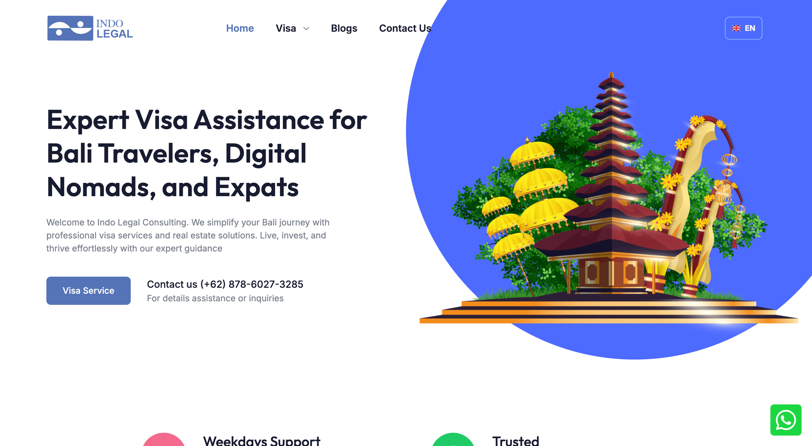
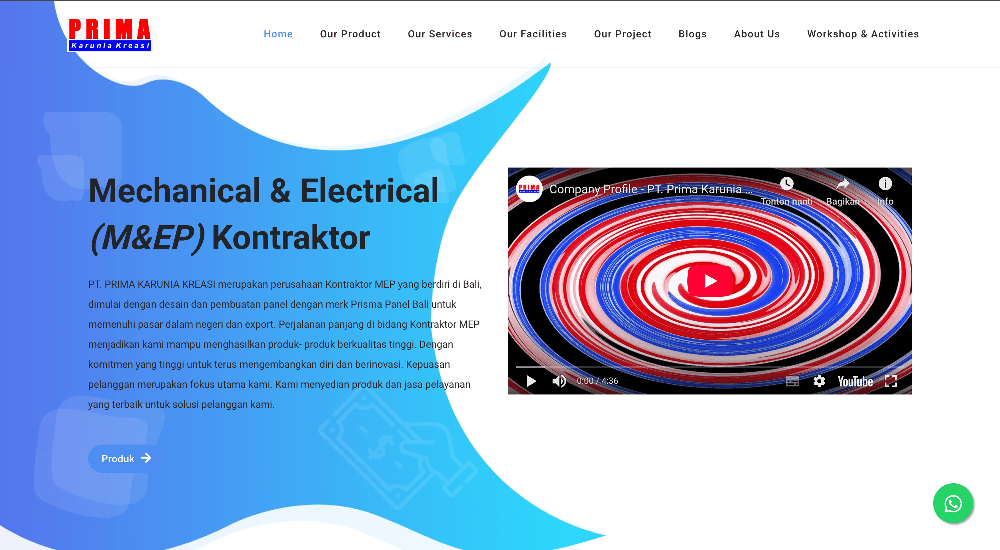
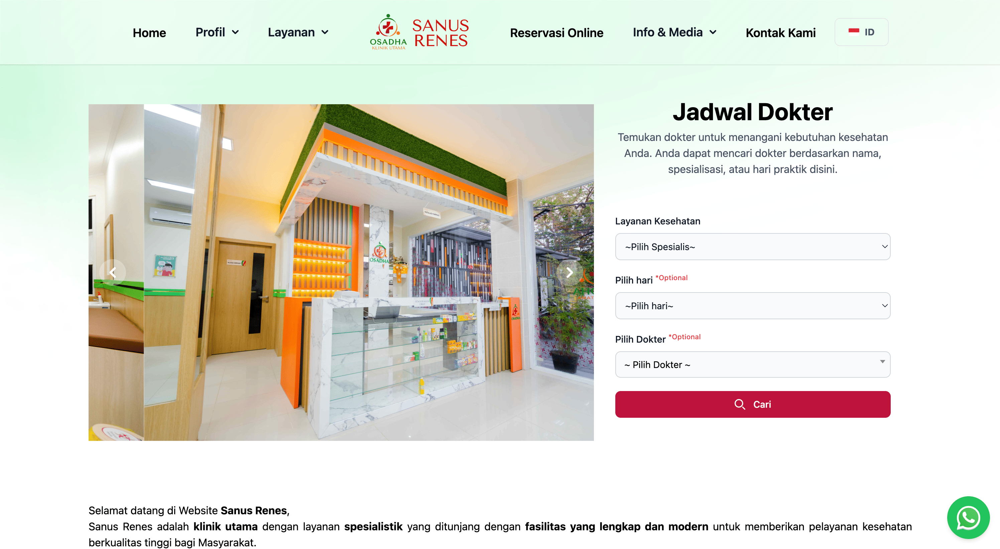
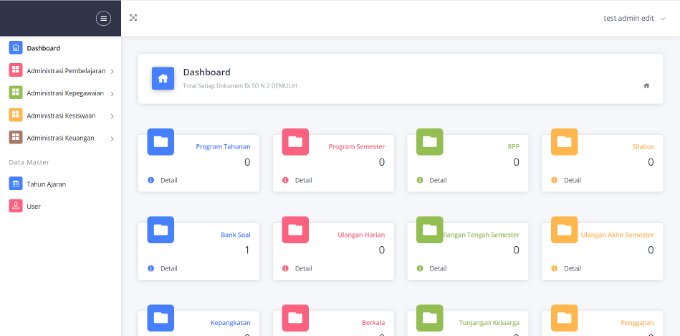
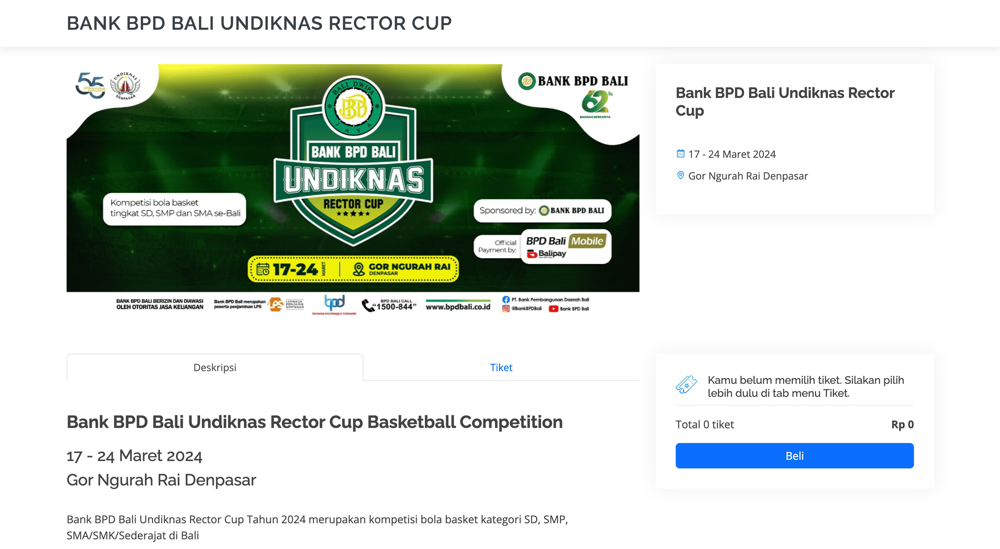
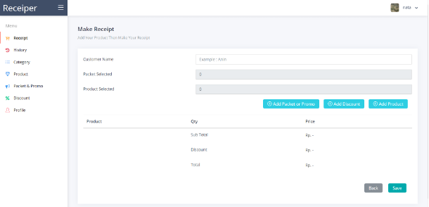
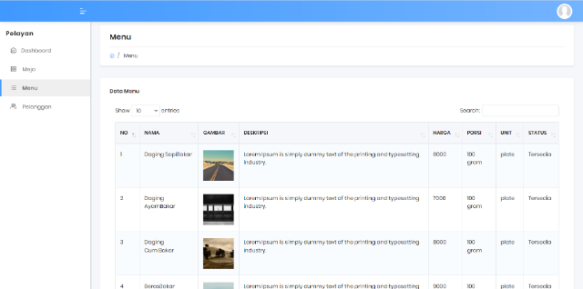
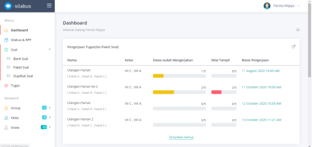

<!doctype html>
<html class="no-js" lang="en">

<head>
    <meta charset="utf-8">

    <!--====== Title ======-->
    <title>Nata - Jasa Freelance</title>

    <meta name="description" content="">
    <meta name="viewport" content="width=device-width, initial-scale=1">

    <!--====== Favicon Icon ======-->
    <link rel="shortcut icon" href="assets/images/favicon.png" type="image/png">

    <!--====== Slick CSS ======-->
    <link rel="stylesheet" href="assets/css/animate.css">

    <!--====== LineIcons CSS ======-->
    <link rel="stylesheet" href="assets/css/lineicons.css">

    <!--====== Bootstrap CSS ======-->
    <link rel="stylesheet" href="assets/css/bootstrap.min.css">

    <!--====== Default CSS ======-->
    <link rel="stylesheet" href="assets/css/default.css">

    <!--====== Style CSS ======-->
    <link rel="stylesheet" href="assets/css/style.css">

</head>

<body>
    <!--[if IE]>
    
You are using an <strong>outdated</strong> browser. Please <a href="https://browsehappy.com/">upgrade your browser</a> to improve your experience and security.

  <![endif]-->
  
    <!--====== PRELOADER PART START ======-->

    

        

            

                

                    

                        

                            

                        

                        

                            

                        

                    

                

            

        

    

    <!--====== PRELOADER PART ENDS ======-->

    <!--====== HEADER PART START ======-->

    <section class="header_area">
        

            

                

                    

                        <nav class="navbar navbar-expand-lg">
                            <a class="navbar-brand" href="index.html">
                                Nata
                            </a>
                            <button class="navbar-toggler" type="button" data-toggle="collapse" data-target="#navbarSupportedContent" aria-controls="navbarSupportedContent" aria-expanded="false" aria-label="Toggle navigation">
                                
                                
                                
                            </button>

                            

                                <ul id="nav" class="navbar-nav ml-auto">
                                    <li class="nav-item">
                                        <a class="page-scroll" href="https://projects.co.id/public/browse_users/view/d79057/nata">Jasa Freelance</a>
                                    </li>
                                </ul>
                            
 <!-- navbar collapse -->
                        </nav> <!-- navbar -->
                    

                
 <!-- row -->
            
 <!-- container -->
        
 <!-- header navbar -->

        

            <ul class="header_social d-none d-lg-block">
                <!-- <li><a href="#"><i class="lni lni-twitter-filled"></i></a></li> -->
                <li><a href="#"><i class="lni lni-linkedin-original"></i></a></li>
            </ul>
            

                

                    

                        

                            <h5 class="header_sub_title wow fadeInUp" data-wow-duration="1.3s" data-wow-delay="0.2s">Hello</h5>
                            <h2 class="header_title wow fadeInUp" data-wow-duration="1.3s" data-wow-delay="0.5s">I'm Nata, Freelance Fullstack Web Developer</h2>
                            
                                <b>My Skill : </b> HTML, CSS, PHP, Javascript, JQuery, Codeigniter 3, Laravel, React.js, Flutter, MySQL, Python
                            
                            <a href="https://projects.co.id/public/browse_users/view/d79057/nata" 
                                rel="nofollow" class="main-btn wow fadeInUp" data-wow-duration="1.3s" 
                                data-wow-delay="1.4s">Jasa Freelance</a>
                        
 <!-- header hero content -->
                    

                    

                        

                            
                        
 <!-- header hero image -->
                    

                
 <!-- row -->
            
 <!-- container -->
            

 <!-- header hero shape -->
        
 <!-- header hero -->
    </section>

    <!--====== HEADER PART ENDS ======-->

    <!--====== PORTFOLIO PART START ======-->

    <section id="services" class="services_area pt-115 pb-120">
        

            

                

                    

                        <h5 class="sub_title">Projects</h5>
                        <h3 class="main_title">My Portfolio Projects</h3>
                        <ul class="line">
                            <li></li>
                            <li></li>
                            <li></li>
                        </ul>
                    
 <!-- section title -->
                

            
 <!-- row -->
            

                

                    

                        

                            
                        

                        

                            <h4 class="service_title"><a href="#">Visa & Legal Consulting Company Profile</a></h4>
                            
Sebuah perusahaan dengan jasa pembuatan visa dan konsultan hukum yang berbasis di Bali.

                        

                    
 <!-- single service -->
                

                

                    

                        

                            
                        

                        

                            <h4 class="service_title"><a href="#">Mechanical & Electrical Contractor Company Profile</a></h4>
                            
Sebuah perusahaan Kontraktor MEP yang berdiri di Bali.

                        

                    
 <!-- single service -->
                

                

                    

                        

                            
                        

                        

                            <h4 class="service_title"><a href="#">Clinic Company Profile</a></h4>
                            
Sebuah klinik utama dengan layanan spesialistik yang ditunjang dengan fasilitas yang lengkap dan modern untuk memberikan pelayanan kesehatan berkualitas tinggi bagi Masyarakat.

                        

                    
 <!-- single service -->
                

                

                    

                        

                            
                        

                        

                            <h4 class="service_title"><a href="#">T-shirt Store Landing Page</a></h4>
                            
Sebuah landing page untuk penjualan kaos polos dengan design dan kualitas premium.

                        

                    
 <!-- single service -->
                

                

                    

                        

                            
                        

                        

                            <h4 class="service_title"><a href="#">Website for School Archives Document</a></h4>
                            
Sebuah website untuk menyimpan dan memanajemen semua arsip dokumen yang dimiliki sebuah sekolah Dasar.

                        

                    
 <!-- single service -->
                

                

                    

                        

                            
                        

                        

                            <h4 class="service_title"><a href="#">Booking Ticket Website</a></h4>
                            
Sebuah website untuk penjualan tiket dengan pembayaran QR yang terintegrasi dengan sebuah bank.

                        

                    
 <!-- single service -->
                

                

                    

                        

                            
                        

                        

                            <h4 class="service_title"><a href="#">Website Cashier</a></h4>
                            
Sebuah website kasir untuk membuat nota dalam bentuk gambar yang sangat cocok untuk reseller rumahan, karena bisa langsung mengirim bukti pembayaran ke pembeli tanpa perlu dicetak.

                        

                    
 <!-- single service -->
                

                

                    

                        

                            
                        

                        

                            <h4 class="service_title">Website For Order in Restaurant</h4>
                            
Sebuah website untuk proses order di sebuah restoran.

                        

                    
 <!-- single service -->
                

                

                    

                        

                            
                        

                        

                            <h4 class="service_title">Website For Learning Activities</h4>
                            

                                Sebuah website yang bisa digunakan untuk membuat Silabus, RPP, dan Bank Soal oleh guru, 
                                kemudian guru bisa membuat ujian dengan sistem soal dengan opsi jawaban yang diacak, 
                                sehingga menurunkan kemungkinan siswa. 
                                Siswa dapan menjawab ujian yang dibuat oleh guru dan dapat melihat nilai yang diperoleh secara langsung.
                            

                        

                    
 <!-- single service -->
                

            
 <!-- row -->
        
 <!-- container -->
    </section>

    <!--====== PORTFOLIO PART ENDS ======-->

    <!--====== CALL TO ACTION PART START ======-->

    <section id="contact" class="call_to_action_area">
        

            

                

                    

                        

                            

                                <h3 class="action_title">Get your personal or business website now</h3>
                                <ul class="line">
                                    <li></li>
                                    <li></li>
                                    <li></li>
                                </ul>
                                

                            
 <!-- call to action content -->

                            

                                <a href="https://projects.co.id/public/browse_users/view/d79057/nata" rel="nofollow" 
                                    class="main-btn">HIRE ME</a>
                            
 <!-- call to action btn -->
                        
 <!-- call to action box -->
                    

                
  <!-- row -->
            
  <!-- call to action wrapper -->
        
 <!-- container -->
    </section>

    <!--====== CALL TO ACTION PART ENDS ======-->

    <!--====== FOOTER PART START ======-->

    <footer id="footer" class="footer_area gray-bg pt-115 pb-120">
        

            

                

                    

                        
© 2025 Nata, all rights reserved

                    
 <!-- footer content -->
                

            
  <!-- row -->
        
 <!-- container -->
    </footer>

    <!--====== FOOTER PART ENDS ======-->

    <!--====== Jquery js ======-->
    
    

    <!--====== Bootstrap js ======-->
    
    

    <!--====== Appear js ======-->
    

    <!--====== Scrolling Nav js ======-->
    
    

    <!--====== Main js ======-->
    

</body>

</html>
